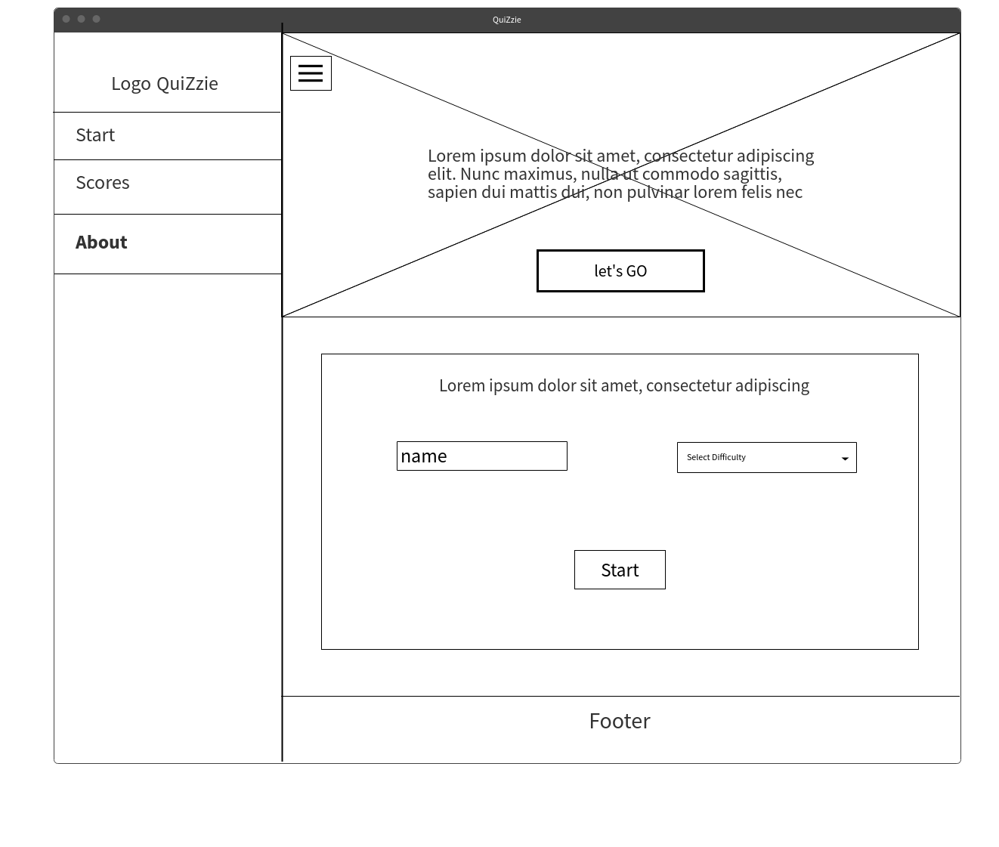
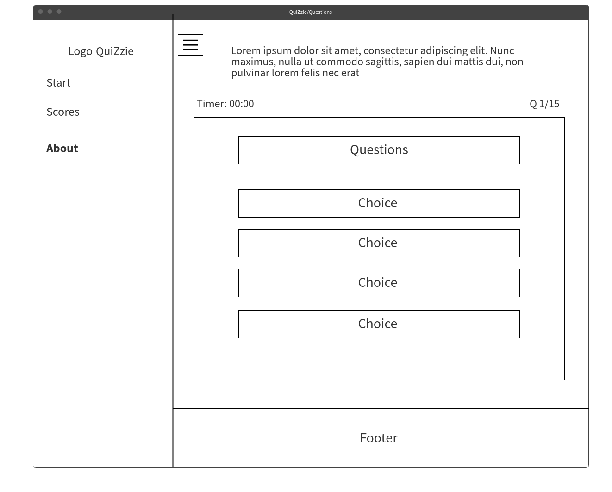
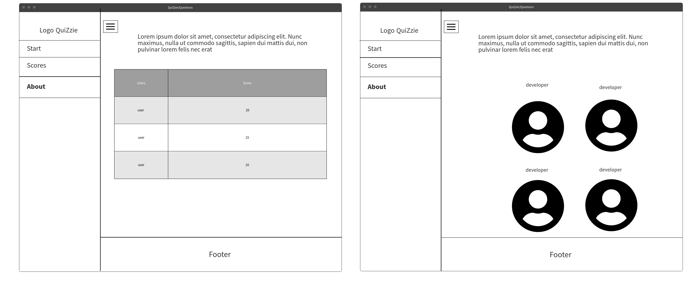
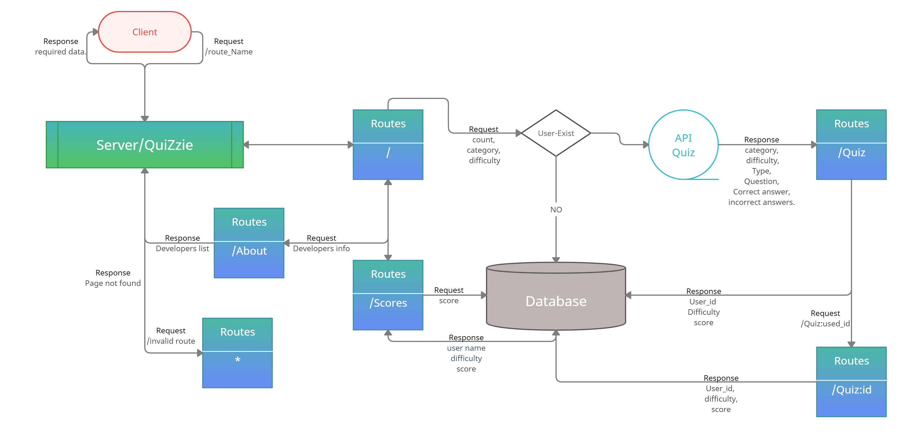
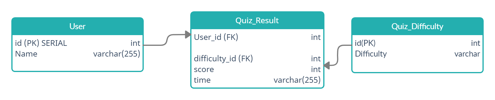

# Awesome-Arrows.

## Dalia Abdelghani
## Noor Alomari
## Walaa Alomari
## Abed alaziz Alsalahat
## Naji A. Albatayneh

# Conflict Plan
for the confluct plan we will be using the **Collaborating** approach for the most important situations, 
it offers a good oppertrunity to learn from others,
> **Treats conflicts as a problem to be solved by examining alternatives**

#### What is the group process to resolve conflict, when it arises?
1. > First we check it's source and where it came from,
2. > Second we'll check if it's solvable, 
3. > Third we'll ask my team for help if it's not solved, 
4. > Last we'll ask the TA's or the istructor for help ASAP.

#### How will you raise concerns to members who are not adequately contributing?
> me personally I don't like to put any conserns on my team, but just in case I'll remindfe them that they don't work alone anymore 
> and if anyone didn't do thair part of work everyone will be effected and we are all in the same bus.

#### How and when will you escalate the conflict if your resolution attempts are unsuccessful?
> in casae the conflict was that hard id unsolvable, I'll send them ASAP.

# Work Plan

#### How will you communicate after hours and on the weekend?
> for communications , I've created a private channel on slack with all of us to talk on, 
> and if there was some major problems we can start a zoom meeting for.
> communication on zoom/remo: from 9am - 5pm, Texting on slack: anytime.

#### What is your strategy for ensuring everyone’s voice is heard?
> as a team leader my job is to ensure that all my team members are satisfied and have no problems, 
> and in case there was a problem between members I'll send them private messages to clearify fthe problem and solve it.

#### How will you ensure that you are creating a safe environment where everyone feels comfortable speaking up?
I'll do my best to make the environment as freindly as possible.

# Git Process

#### What components of your project will live on GitHub?
> public file, server.js file, README file, license file.

#### How will you share the repository with your teammates?
> by creating an organization and grant them access to modify the any thing in the repo.

#### What is your Git flow?
> we will be using the Centralized Workflow
> First, distributed version control system.
> Second, it gives you access to Git’s robust branching and merging model.

#### Will you be using a PR review workflow? If so, consider:
no.

# User story:
- *As a user,* I want a breif describtion about the application so I will take an idea about what I WILL my experience in the application .

- *As a user,* I want a navigation bar so that I can move between the pages .

- *As a user,* I want a simple, clean looking UI so that my application is easy to navigate.

- *As a user,* I want  a form to enter my name in input  name so I can see my result after finish the quiz .

- *As a user,* I want a select menue to choose the quiz’s difficulty so i can start quiz with level i choose .

- *As a user,* I want a screen which show  questions and list of answers so i can read the question and answer it .

- *As a user,* I want a next button which shown after answer the question ,so that I can move to next question or result   page .

- *As a user,* I want to have an indication so that I know my answer is correct

- *As a user,* I want div to show my score  after finish the quiz so that  I Can see my result .

- *As a user,* I want a button to navigate to top-scores page ,so that I Can see the other player's results.

- *As a user,* I want table of results and names of ather players,so I can  see the top scores of other people who takes the quizzes.
- *As a user,* I want a responsive layout ,so I can use this application on my mobile . 

- **Stretch goal:**  As a user, I want to save my name and choose to the website so I can. 

- **Stretch goal:**  As a user, I want to choose the category of information I want to test.

- **Stretch goal:**  As a use, I want to get a success response with a celebration if I answered all the questions correctly.

# Wireframe

## Home Page

## Questions Page

## Scores and About Page

# Data flow Diagram (DFD)

# ER Diagram

